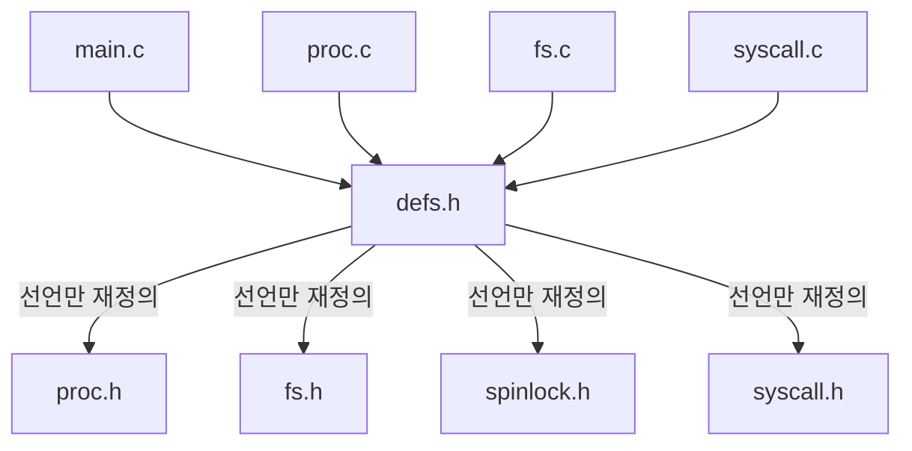

cpp에서는 헤더를 제대로 관리 하지 않으면 컴파일 단계에서 이중 선언 등의 문제가 자주 발생한다.


## 개념 구분

- Declaration: 변수의 이름과 타입만 알림 (extern)
- Definition: 변수에 실제로 메모리를 할당하라고 선언
- Allocation: 운영체제가 메모리를 할당해준다는 의미


***


## 헤더 용도
### 1. 매크로 및 상수 정의 분리
- `#define`, `const` 를 헤더에 모아 관리  
- prameter 값만 모아둔 `param.h` 를 만들기도 함
```c
#define MAX_BUFFER_SIZE 1024
const double PI = 3.141592;
```


### 2. 공통으로 사용하는 데이터 타입 선언
- 여러 `.c` 파일에서 공유할 `struct`, `enum`, `typedef` 등을 선언  
- ==전역 변수는 `extern`으로 선언만 하고, 정의는 `.c`에 둠  ==
```c
typedef struct {
    int id;
    char name[50];
} User;

extern int global_count;
```


### 3. 함수 인터페이스 제공 (선언)
- 각 `.c` 파일에서 구현한 함수를 다른 파일에서 사용할 수 있도록 함수 원형(prototype)을 선언  
- `static inline` 함수의 경우, 예외적으로 헤더에 구현 포함 가능  

#### 일반 함수
다시 각 파일에서 구현해야 사용 가능한다. (단, 한번만 구현할 수 있음 중복 X)
함수를 참조할 수 있게 하는 역할을 수행한다.
```c
// math_utils.h
int add(int a, int b);
```

#### inline 함수
간단한 함수의 경우 헤더에 구현하여 전역으로 사용할 수 있도록 한다.
```c
static inline int square(int x) {
    return x * x;
}
```

***


## 헤더 사용시 주의

- 절대 구현(정의)을 헤더에서 하면 안된다. -> 여러번 참조하면 중복 선언 문제
- 공유변수가 아니면 굳이 헤더에 선언할 필요가 없다. 참조 되지 않는 변수는 헤더에 선언하지 말자.
  (따라서 module에 사용되는 변수는 대부분 헤더에 들어간다.)
- struct를 만드는 경우 헤더에 만드는 것이 보통이다. 참조되는 경우는 extern까지 해주고, 그렇지 않다면 그냥 파일 내에서 선언하여 사용하자.

***


## 헤더 사용을 고려해야하는 상황

명확히 경계가 있는 분류는 아니지만, 다양한 상황을 통해 헤더의 활용을 알아보자.

### parameter가 많은 경우

![[Pasted image 20250503081728.png]]


### 라이브러리를 만드는 경우
몇가지 기능(함수)을 가지고 있는 module을 만드는 경우 h의 참조로만 기능을 사용할 수 있게 만드는게 중요하다.

ex)
math_utils.h
```c
#define MATH_UTILS_H

int add(int a, int b);
int subtract(int a, int b);

```

math_utils.c
```c
#include "math_utils.h"

int add(int a, int b) {
    return a + b;
}

int subtract(int a, int b) {
    return a - b;
}
```


### 시스템의 사이즈가 큰 경우
xv6 시스템처럼 공유 변수가 여러 파일에 흩어져있는 경우는 참조 하다보면 순환참조의 문제가 발생하기도 한다.
(module_01.h <-> module_02.h 가 서로 참조)
따라서 시스템이 커지면 사전처럼 모든 공유변수를 선언만 하고있는 defs.h를 만드는 것이 유용하다.
defs.h는 다른 헤더를 하나도 참조하지 않으므로 다른 모듈에서는 defs.h를 안전하게 참조할 수 있다.

`개념적으로 여러가지 헤더파일들이 defs.h를 경유하여 참조하는 것이다.`




## struct / enum을 선언하는 경우

struct, enum은 하나의 file에서만 사용하더라도 헤더에 선언하는 것이 일반적이다.
만약 참조되는 변수라면 extern까지 헤더에서 해주고, 아니라면 그냥 file 내에서 정의하여 사용.


## 시스템의 상태에 따라 분기가 필요한 경우

```c
// config.h
#ifdef _WIN32
#define PATH_SEPARATOR '\\'
#else
#define PATH_SEPARATOR '/'
#endif
```


***


## 디렉터리 구조 예시


```
project_root/
├── include/             # 📌 공개 헤더 파일 (.h)
│   ├── project/         # 네임스페이스 역할
│   │   ├── module1.h
│   │   ├── module2.h
│   │   └── common.h
│   └── project.h        # 전체 엔트리 포인트 헤더 (선택)
│
├── src/                 # 📌 구현 파일 (.c)
│   ├── module1.c
│   ├── module2.c
│   └── main.c
│
├── test/                # 테스트 코드
│   └── test_module1.c
│
├── build/               # 빌드 아티팩트 (obj, bin 등)
│
├── Makefile             # 빌드 스크립트
└── README.md
```